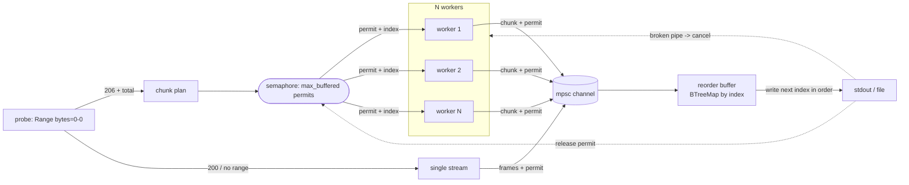

# pcurl

[English](README.md) · [简体中文](README.zh-CN.md) · [日本語](README.ja.md) · [한국어](README.ko.md) · **Español**

Descargador HTTP paralelo que transmite a stdout en orden estricto, listo para
canalizar directamente a un descompresor.

```sh
pcurl https://example.com/huge.tar.zst | zstd -d | tar x
```

`pcurl` divide un archivo remoto en rangos de bytes, los obtiene por varias
conexiones a la vez para superar los límites de velocidad por conexión, los
reensambla en orden dentro de un búfer en memoria acotado y escribe el flujo de
bytes original en stdout. El orden de los bytes en stdout es idéntico al del
archivo de origen, por lo que la salida se puede canalizar sin riesgo a `zstd`,
`gzip`, `tar` o cualquier consumidor de flujo.

## Cuándo usarlo

Tienes un archivo comprimido grande —un conjunto de datos, un checkpoint de
modelo, una copia de seguridad— y necesitas extraerlo en una máquina que no tiene
espacio para el archivo *y* su contenido a la vez. El truco habitual transmite la
descarga directamente a un descompresor para que el archivo comprimido nunca
llegue al disco:

```sh
curl https://host/huge.tar.zst | zstd -d | tar x
```

Así el disco solo guarda los ficheros extraídos, pero `curl` descarga por una
sola conexión. Frente a un límite de velocidad por conexión (o en un enlace de
gran ancho de banda y alta latencia que un único flujo TCP no puede llenar), un
archivo de varios terabytes puede tardar días.

Los descargadores paralelos (`aria2c`, `axel`, …) obtienen por muchas conexiones,
pero **escriben el fichero en disco**, devolviendo todo el archivo al disco que
querías evitar.

`pcurl` es la combinación que faltaba: obtiene en paralelo por muchas conexiones
*y* transmite el resultado en orden estricto a stdout, así que encaja en la misma
tubería:

```sh
pcurl https://host/huge.tar.zst | zstd -d | tar x
```

|                         | transmite a una tubería (sin archivo en disco) | conexiones en paralelo |
| ----------------------- | :---: | :---: |
| `curl \| zstd \| tar`   | yes   | no    |
| `aria2c`, `axel`        | no    | yes   |
| `pcurl \| zstd \| tar`  | yes   | yes   |

Obtienes rendimiento en paralelo con el modelo de streaming de curl: el archivo
comprimido nunca se almacena, solo la salida extraída toca el disco. La memoria
se mantiene acotada (un búfer fijo pequeño, independiente del tamaño del archivo),
y si el descompresor o el disco no dan abasto, la tubería aplica contrapresión a
la descarga automáticamente, de modo que una máquina con poco espacio o memoria
se mantiene dentro de sus límites.

## Características

- Descarga por rangos con múltiples conexiones: N workers obtienen fragmentos `Range` en paralelo, por HTTP/1.1 de forma predeterminada, de modo que cada uno es una conexión TCP independiente (`--http2` para multiplexar en una sola).
- Salida en orden estricto: los fragmentos desordenados se reordenan antes de llegar a stdout.
- Memoria acotada: el uso máximo es aproximadamente `max_buffered * chunk_size`, independiente de la velocidad de descarga.
- Amigable con tuberías: datos en stdout, progreso en stderr, parada limpia ante una tubería rota.
- Bytes literales: sin decodificación de contenido transparente, así la salida es igual al archivo tal como lo sirve el servidor.
- Reintento por fragmento con retroceso exponencial acotado y jitter.
- Repliegue automático a un único flujo directo cuando el servidor no admite rangos.
- Registro estructurado opcional a fichero con rotación, junto al registro por niveles en stderr.

## Instalación

```sh
cargo install --path .
# o compila un binario de release
cargo build --release   # ./target/release/pcurl
```

## Uso

```sh
pcurl [OPTIONS] <URL>
```

Opciones comunes:

| Opción | Predeterminado | Significado |
| --- | --- | --- |
| `-c, --connections <N>` | `8` | Conexiones en paralelo (workers). |
| `-s, --chunk-size <SIZE>` | `8M` | Tamaño del fragmento de rango (`4M`, `512K`, `1048576`). |
| `--max-buffered <N>` | `= 2 × connections` | Máximo de fragmentos en memoria a la vez; memoria pico `~= N * chunk_size`. Esta lectura anticipada evita que un fragmento lento atasque la escritura en orden. |
| `-r, --retries <N>` | `20` | Reintentos por fragmento; solo se usa cuando `--retry-max-secs 0`. |
| `--retry-max-secs <SECS>` | `300` | Presupuesto de reintento por reloj de pared y fragmento: un fragmento sigue reintentando un fallo transitorio hasta que transcurre este tiempo, así una caída que rechaza rápido no aborta la ejecución tan pronto como un número fijo de intentos (`0` = usar `--retries`). |
| `-t, --timeout <SECS>` | `60` | Tiempo de espera de conexión + inactividad (lectura); se reinicia en cada lectura, así acota los bloqueos sin matar una transferencia lenta sana (`0` lo desactiva). |
| `--min-speed <SIZE>` | `8K` | Velocidad mínima sostenida por fragmento; un fragmento cuyo promedio caiga por debajo durante `--min-speed-window` (predeterminado `15`s) se descarta y reintenta para que una conexión que gotea no atasque el flujo (`0` lo desactiva). Para reasignar un borde meramente lento (no atascado) en un enlace rápido, sube esto (p. ej. `1M`) y pon `--min-speed-window` por debajo del tiempo de transferencia de un fragmento sano. |
| `-o, --output <FILE>` | stdout | Escribe en un fichero en lugar de stdout. |
| `--single` | off | Fuerza un único flujo directo. |
| `--http2` | off | Usa HTTP/2 si el servidor lo ofrece. De forma predeterminada pcurl fuerza HTTP/1.1 para que cada conexión sea un flujo TCP separado; por HTTP/2 los workers se multiplexan en una sola conexión y no pueden superar el límite de velocidad por conexión. |
| `-H, --header <H>` | ninguno | Cabecera de petición adicional (`"Name: value"`), repetible. |
| `-q, --quiet` | off | Suprime la línea de progreso en stderr. |
| `-v, --verbose` | off | Más registro en stderr (`-v`, `-vv`); `RUST_LOG` tiene prioridad. |
| `--log-dir <DIR>` | ninguno | Escribe además registros con rotación en un directorio. |

Ejemplos:

```sh
# Descargar y extraer un archivo comprimido de una sola pasada
pcurl https://example.com/dataset.tar.zst | zstd -d | tar x

# 16 conexiones, fragmentos de 4 MiB, memoria limitada a 8 fragmentos (~32 MiB)
pcurl -c 16 -s 4M --max-buffered 8 https://example.com/big.bin > big.bin

# Enviar una cabecera de autenticación; escribir en un fichero
pcurl -H "Authorization: Bearer $TOKEN" -o out.bin https://host/object
```

## Cómo funciona



El límite de memoria y la garantía de orden provienen de un único invariante:
cada fragmento en vuelo o en búfer mantiene exactamente un permiso de semáforo, y
un permiso solo se libera después de que su fragmento se ha escrito en la salida.
Un worker debe tomar un permiso antes de reclamar el siguiente índice de
fragmento, por lo que el número de fragmentos vivos a la vez nunca supera
`max_buffered`. Como los índices se reparten en orden creciente, el fragmento que
el escritor necesita a continuación siempre está ya en vuelo, así que el
reensamblado nunca se atasca.

Cuando el consumidor cierra la salida pronto (por ejemplo `| head`), la siguiente
escritura falla con una tubería rota; el escritor cancela todos los workers y el
proceso termina limpiamente.

## Código de salida en tuberías

Una descarga limpia termina con `0`; una descarga que falla (un error de
fragmento irrecuperable, o no se escribieron todos los bytes) termina con un
código distinto de cero. Que el consumidor cierre la tubería pronto es un éxito
para pcurl. Una señal de terminación (SIGINT/SIGTERM) cancela la ejecución y
termina con `130`; como no hay reanudación, una descarga interrumpida debe
reiniciarse. En una tubería de shell el estado global es el de la última etapa,
así que usa `set -o pipefail` y comprueba el propio código de salida de pcurl
para detectar un fallo de descarga:

```sh
set -o pipefail
pcurl https://example.com/huge.tar.zst | zstd -d | tar x
echo "pcurl=${PIPESTATUS[0]} zstd=${PIPESTATUS[1]} tar=${PIPESTATUS[2]}"
```

Una herramienta posterior que muere por su cuenta (por ejemplo `tar x` quedándose
sin disco) se refleja en su propio código de salida, no en el de pcurl.

## Registro

Los registros van a stderr (nunca a stdout). Niveles: `TRACE`, `DEBUG`, `INFO`,
`WARN`, `ERROR`, filtrables por módulo mediante `RUST_LOG` (que tiene prioridad
sobre `-v`). Con `--log-dir`, los registros también se escriben en un fichero con
rotación diaria que conserva los `--log-keep` más recientes.

## Desarrollo

```sh
cargo test                       # unitarias + integración + extremo a extremo (la prueba de tubería necesita zstd)
cargo test --test e2e <name>     # una prueba extremo a extremo
cargo clippy --all-targets -- -D warnings
cargo fmt --check
```

Las pruebas de integración ejecutan el binario compilado contra un servidor
`tiny_http` local (`tests/common`) y corren en serie, así que la suite completa
tarda ~15-20 s.

## Licencia

MIT. Véase [LICENSE](LICENSE).
