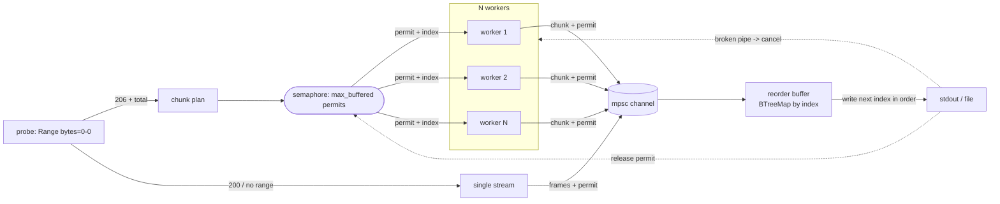

# pcurl

[English](README.md) · [简体中文](README.zh-CN.md) · **日本語** · [한국어](README.ko.md) · [Español](README.es.md)

stdout へ厳密に順序どおりストリーミングする並列 HTTP ダウンローダー。展開コマンドへ
そのままパイプできます。

```sh
pcurl https://example.com/huge.tar.zst | zstd -d | tar x
```

`pcurl` はリモートファイルをバイト範囲に分割し、複数の接続で同時に取得して単一接続の
レート制限を回避し、有界なメモリバッファ内で順序どおりに再構成して、元のバイトストリームを
stdout へ書き出します。stdout 上のバイト順序はソースファイルと同一なので、出力は `zstd`、
`gzip`、`tar` などの任意のストリーミング処理へ安全にパイプできます。

## こんなときに

大きな圧縮アーカイブ（データセット、モデルのチェックポイント、バックアップ）を、
**アーカイブとその展開結果の両方を置く余裕がない**マシンで展開したい。定番の手法は、
ダウンロードをそのまま展開コマンドへ流し、圧縮ファイルをディスクに一切置かないことです:

```sh
curl https://host/huge.tar.zst | zstd -d | tar x
```

これでディスク使用量は展開後のファイルだけで済みます。しかし `curl` は単一接続で引っ張り
ます。接続ごとのレート制限がある場合（あるいは広帯域・高遅延の回線で 1 本の TCP フローでは
埋めきれない場合）、数 TB のアーカイブは何日もかかり得ます。

並列ダウンローダー（`aria2c`、`axel` など）は多数の接続で取得しますが、**ファイルをディスク
に書き込みます** —— 避けたかったはずのディスクへアーカイブ全体を戻してしまいます。

`pcurl` はその欠けた組み合わせです。多数の接続で並列に取得し、**かつ**結果を厳密に順序
どおり stdout へストリーミングするので、まったく同じパイプにそのまま組み込めます:

```sh
pcurl https://host/huge.tar.zst | zstd -d | tar x
```

|                         | パイプへストリーム（アーカイブを置かない） | 並列接続 |
| ----------------------- | :---: | :---: |
| `curl \| zstd \| tar`   | yes   | no    |
| `aria2c`、`axel`        | no    | yes   |
| `pcurl \| zstd \| tar`  | yes   | yes   |

curl のストリーミングモデルのまま並列スループットが得られます。圧縮アーカイブは保存されず、
展開後の出力だけがディスクに触れます。メモリは有界のまま（アーカイブのサイズに依らない
小さな固定バッファ）で、展開コマンドやディスクが追いつかなければパイプが自動的にダウンロード
へバックプレッシャーをかけます —— 容量やメモリが限られたマシンでも上限内に収まります。

## 特徴

- 複数接続の範囲ダウンロード: N 個のワーカーが `Range` チャンクを並列取得。既定では HTTP/1.1 を使い、各接続が独立した TCP 接続になります（`--http2` で 1 本に多重化）。
- 厳密な順序出力: 順不同で届いたチャンクは stdout に達する前に並べ替えられます。
- 有界メモリ: ピーク使用量は概ね `max_buffered * chunk_size` で、ダウンロード速度に依りません。
- パイプ親和: データは stdout、進捗は stderr、パイプ切断時はクリーンに停止。
- バイトをそのまま: 透過的なコンテンツデコードを行わないため、出力は配信されたファイルと一致します。
- チャンクごとの再試行（上限付き指数バックオフ＋ジッター）。
- サーバーが範囲リクエストに対応しない場合、単一の直通ストリームへ自動フォールバック。
- 任意の構造化ファイルログ（ローテーション付き）を、レベル別 stderr ログと併用可能。

## インストール

```sh
cargo install --path .
# またはリリースバイナリをビルド
cargo build --release   # ./target/release/pcurl
```

## 使い方

```sh
pcurl [OPTIONS] <URL>
```

主なオプション:

| オプション | 既定値 | 意味 |
| --- | --- | --- |
| `-c, --connections <N>` | `8` | 並列接続数（ワーカー）。 |
| `-s, --chunk-size <SIZE>` | `8M` | 範囲チャンクのサイズ（`4M`、`512K`、`1048576`）。 |
| `--max-buffered <N>` | `= 2 × connections` | メモリに同時保持するチャンク数の上限。ピークメモリは `~= N * chunk_size`。この先読み分が、遅い 1 チャンクで順序付き書き出しが詰まるのを防ぎます。 |
| `-r, --retries <N>` | `20` | チャンクごとの再試行回数。`--retry-max-secs 0` のときのみ使用。 |
| `--retry-max-secs <SECS>` | `300` | チャンクごとの実時間（壁時計）再試行予算。一過性の失敗をこの時間が尽きるまで再試行し続けるので、即座に失敗を返す障害でも固定回数のように素早く全体を中止しません（`0` = `--retries` を使用）。 |
| `-t, --timeout <SECS>` | `60` | 接続 + アイドル（読み取り）タイムアウト。読み取りごとにリセットされるため、停滞は抑えつつ健全な低速転送は止めません（`0` で無効）。 |
| `--min-speed <SIZE>` | `8K` | チャンクごとの最低持続速度。`--min-speed-window`（既定 `15` 秒）の平均がこれを下回るチャンクは破棄して再試行し、細々と流れる接続がストリーム全体を詰まらせるのを防ぎます（`0` で無効）。高速回線で「停止はしていないが遅いだけ」のエッジを再配置するには、この値を上げ（例: `1M`）、`--min-speed-window` を健全なチャンクの転送時間より短く設定します。 |
| `-o, --output <FILE>` | stdout | stdout ではなくファイルへ書き出す。 |
| `--single` | off | 単一の直通ストリームを強制する。 |
| `--http2` | off | サーバーが提供すれば HTTP/2 を使用。既定では pcurl は HTTP/1.1 を強制し、各接続を独立した TCP フローにします。HTTP/2 ではワーカーが 1 本の接続に多重化され、接続ごとのレート制限を回避できません。 |
| `-H, --header <H>` | なし | 追加のリクエストヘッダー（`"Name: value"`）。繰り返し可。 |
| `-q, --quiet` | off | stderr の進捗行を抑制する。 |
| `-v, --verbose` | off | stderr のログを増やす（`-v`、`-vv`）。`RUST_LOG` が優先。 |
| `--log-dir <DIR>` | なし | ローテーションログを指定ディレクトリにも書き出す。 |

例:

```sh
# 圧縮アーカイブのダウンロードと展開を一度に
pcurl https://example.com/dataset.tar.zst | zstd -d | tar x

# 16 接続、4 MiB チャンク、メモリ上限 8 チャンク（~32 MiB）
pcurl -c 16 -s 4M --max-buffered 8 https://example.com/big.bin > big.bin

# 認証ヘッダーを送り、ファイルへ書き出す
pcurl -H "Authorization: Bearer $TOKEN" -o out.bin https://host/object
```

## 仕組み



メモリ上界と順序保証は 1 つの不変条件から来ます。すなわち、転送中またはバッファ中の各
チャンクはちょうど 1 つのセマフォ許可を保持し、許可はそのチャンクが出力へ書き込まれた後に
のみ解放されます。ワーカーは次のチャンク番号を取得する前に許可を取らねばならないため、同時に
生存するチャンク数は決して `max_buffered` を超えません。番号は昇順で配られるので、書き出し側が
次に必要とするチャンクは常に既に転送中であり、再構成が停滞することはありません。

消費側が出力を早めに閉じると（例: `| head`）、次の書き込みがパイプ切断で失敗します。書き出し側は
全ワーカーをキャンセルし、プロセスはクリーンに終了します。

## パイプでの終了コード

正常なダウンロードは `0` で終了します。失敗したダウンロード（回復不能なチャンクエラー、または
全バイトを書き出せなかった場合）は非ゼロで終了します。消費側がパイプを早めに閉じることは
pcurl にとっては成功です。終了シグナル（SIGINT/SIGTERM）は実行をキャンセルして `130` で終了
します。レジューム機能はないため、中断されたダウンロードはやり直しが必要です。シェルパイプでは
全体の終了コードは最後の段のものなので、ダウンロード失敗を捕捉するには `set -o pipefail` を使い、
pcurl 自身の終了コードを確認してください:

```sh
set -o pipefail
pcurl https://example.com/huge.tar.zst | zstd -d | tar x
echo "pcurl=${PIPESTATUS[0]} zstd=${PIPESTATUS[1]} tar=${PIPESTATUS[2]}"
```

下流ツール自身の失敗（例: `tar x` のディスク満杯）は、pcurl ではなくそのツール自身の終了コードに
現れます。

## ログ

ログは stderr へ出ます（stdout には決して出しません）。レベル: `TRACE`、`DEBUG`、`INFO`、
`WARN`、`ERROR`。`RUST_LOG` でモジュール単位にフィルタできます（`-v` より優先）。`--log-dir`
を指定すると、日次ローテーションのファイルにも書き出し、直近 `--log-keep` 件を保持します。

## 開発

```sh
cargo test                       # 単体 + 結合 + エンドツーエンド（パイプテストに zstd が必要）
cargo test --test e2e <name>     # 単一のエンドツーエンドテスト
cargo clippy --all-targets -- -D warnings
cargo fmt --check
```

結合テストはコンパイル済みバイナリをローカルの `tiny_http` サーバー（`tests/common`）に対して
駆動し、直列に実行されるため、全体で約 15〜20 秒かかります。

## ライセンス

MIT。[LICENSE](LICENSE) を参照。
