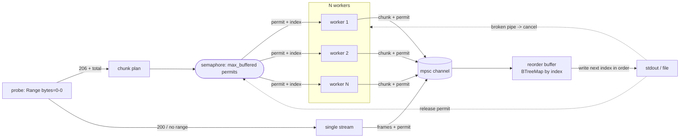

# pcurl

[English](README.md) · [简体中文](README.zh-CN.md) · [日本語](README.ja.md) · **한국어** · [Español](README.es.md)

[](https://github.com/SinlinLi/pcurl/actions/workflows/ci.yml) [](https://github.com/SinlinLi/pcurl/releases) [](LICENSE)

**상태:** 초기 단계(0.x) · Linux x86_64/aarch64 · stdout으로 스트리밍, 설계상 재개 없음.

stdout으로 엄격히 순서대로 스트리밍하는 병렬 HTTP 다운로더. 압축 해제기로 바로 파이프할
수 있습니다.

```sh
pcurl https://example.com/huge.tar.zst | zstd -d | tar x
```

`pcurl`은 원격 파일을 바이트 범위로 나누고, 여러 연결로 동시에 가져와 단일 연결 속도
제한을 우회하며, 한정된 메모리 버퍼 안에서 순서대로 재조립한 뒤 원본 바이트 스트림을
stdout으로 씁니다. stdout의 바이트 순서는 원본 파일과 동일하므로, 출력을 `zstd`, `gzip`,
`tar` 또는 임의의 스트리밍 소비자에게 안전하게 파이프할 수 있습니다.

## 언제 쓰나

큰 압축 아카이브(데이터셋, 모델 체크포인트, 백업)를 **아카이브와 그 압축 해제 결과를
둘 다 담을 공간이 없는** 머신에서 풀어야 할 때가 있습니다. 표준 기법은 다운로드를 곧바로
압축 해제기로 흘려보내 압축 파일이 디스크에 전혀 떨어지지 않게 하는 것입니다:

```sh
curl https://host/huge.tar.zst | zstd -d | tar x
```

이러면 디스크에는 풀어낸 파일만 남습니다. 하지만 `curl`은 단일 연결로 받아옵니다. 연결당
속도 제한이 있거나(또는 대역폭이 크고 지연이 큰 회선에서 TCP 흐름 하나로는 채우지 못할 때),
수 TB 아카이브는 며칠이 걸릴 수 있습니다.

병렬 다운로더(`aria2c`, `axel` 등)는 여러 연결로 가져오지만 **파일을 디스크에 씁니다** ——
피하려던 그 디스크에 아카이브 전체를 다시 올려놓는 셈입니다.

`pcurl`은 빠져 있던 그 조합입니다. 여러 연결로 병렬 수신하면서 **동시에** 결과를 엄격히
순서대로 stdout으로 스트리밍하므로, 똑같은 파이프에 그대로 끼울 수 있습니다:

```sh
pcurl https://host/huge.tar.zst | zstd -d | tar x
```

|                         | 파이프로 스트림(아카이브를 디스크에 두지 않음) | 병렬 연결 |
| ----------------------- | :---: | :---: |
| `curl \| zstd \| tar`   | yes   | no    |
| `aria2c`, `axel`        | no    | yes   |
| `pcurl \| zstd \| tar`  | yes   | yes   |

curl의 스트리밍 모델 그대로 병렬 처리량을 얻습니다. 압축 아카이브는 저장되지 않고, 풀어낸
출력만 디스크에 닿습니다. 메모리는 한정된 상태(아카이브 크기와 무관한 작은 고정 버퍼)를
유지하며, 압축 해제기나 디스크가 따라오지 못하면 파이프가 자동으로 다운로드에 백프레셔를
겁니다 —— 그래서 공간이나 메모리가 빠듯한 머신도 한계 안에 머무릅니다.

## 기능

- 다중 연결 범위 다운로드: N개의 워커가 `Range` 청크를 병렬로 가져옵니다. 기본은 HTTP/1.1이라 각 연결이 독립적인 TCP 연결입니다(`--http2`로 하나에 다중화).
- 엄격한 순서 출력: 순서가 어긋나 도착한 청크는 stdout에 닿기 전에 재정렬됩니다.
- 한정된 메모리: 최대 사용량은 대략 `max_buffered * chunk_size`이며 다운로드 속도와 무관합니다.
- 파이프 친화: 데이터는 stdout, 진행 표시는 stderr, 파이프가 끊기면 깔끔하게 정지합니다.
- 바이트 그대로: 투명한 콘텐츠 디코딩을 하지 않으므로 출력은 서버가 제공한 파일과 일치합니다.
- 청크별 재시도(상한 있는 지수 백오프 + 지터).
- 서버가 범위 요청을 지원하지 않으면 단일 직통 스트림으로 자동 폴백.
- 선택적 구조화 파일 로깅(로테이션 지원)을 레벨별 stderr 로그와 함께 사용 가능.

## 설치

```sh
cargo install --path .
# 또는 릴리스 바이너리 빌드
cargo build --release   # ./target/release/pcurl
```

## 사용법

```sh
pcurl [OPTIONS] <URL>
```

자주 쓰는 옵션:

| 옵션 | 기본값 | 의미 |
| --- | --- | --- |
| `-c, --connections <N>` | `8` | 병렬 연결 수(워커). |
| `-s, --chunk-size <SIZE>` | `8M` | 범위 청크 크기(`4M`, `512K`, `1048576`). |
| `--max-buffered <N>` | `= 2 × connections` | 메모리에 동시에 보관하는 청크 수 상한. 최대 메모리는 `~= N * chunk_size`. 이 미리 읽기 여유분이 느린 청크 하나가 순서 기반 쓰기를 막는 것을 방지합니다. |
| `-r, --retries <N>` | `20` | 청크별 재시도 횟수. `--retry-max-secs 0`일 때만 사용됩니다. |
| `--retry-max-secs <SECS>` | `300` | 청크별 실시간(벽시계) 재시도 예산. 일시적 실패를 이 시간이 다할 때까지 계속 재시도하므로, 빠르게 거부되는 장애에서도 고정 횟수처럼 빨리 전체를 중단하지 않습니다(`0` = `--retries` 사용). |
| `-t, --timeout <SECS>` | `60` | 연결 + 유휴(읽기) 타임아웃. 읽기마다 초기화되어 정체는 막되 건강한 느린 전송은 죽이지 않습니다(`0`이면 비활성화). |
| `--min-speed <SIZE>` | `8K` | 청크별 최소 지속 속도. `--min-speed-window`(기본 `15`초) 평균이 이보다 낮은 청크는 버리고 재시도하여, 가늘게 흐르는 연결이 스트림을 막지 못하게 합니다(`0`이면 비활성화). 빠른 회선에서 "멈추진 않았지만 그냥 느린" 엣지를 재배치하려면 이 값을 올리고(예: `1M`) `--min-speed-window`를 건강한 청크의 전송 시간보다 짧게 설정하세요. |
| `-o, --output <FILE>` | stdout | stdout 대신 파일에 씁니다. |
| `--single` | off | 단일 직통 스트림을 강제합니다. |
| `--http2` | off | 서버가 제공하면 HTTP/2를 사용합니다. 기본적으로 pcurl은 HTTP/1.1을 강제하여 각 연결을 독립적인 TCP 흐름으로 만듭니다. HTTP/2에서는 워커들이 하나의 연결에 다중화되어 연결당 속도 제한을 우회할 수 없습니다. |
| `-H, --header <H>` | 없음 | 추가 요청 헤더(`"Name: value"`). 반복 가능. |
| `-q, --quiet` | off | stderr 진행 표시 줄을 억제합니다. |
| `-v, --verbose` | off | stderr 로그를 늘립니다(`-v`, `-vv`). `RUST_LOG`가 우선합니다. |
| `--log-dir <DIR>` | 없음 | 로테이션 로그를 지정 디렉터리에도 씁니다. |

예시:

```sh
# 압축 아카이브를 한 번에 다운로드하고 풀기
pcurl https://example.com/dataset.tar.zst | zstd -d | tar x

# 16개 연결, 4 MiB 청크, 메모리 상한 8청크(~32 MiB)
pcurl -c 16 -s 4M --max-buffered 8 https://example.com/big.bin > big.bin

# 인증 헤더 전송; 파일에 쓰기
pcurl -H "Authorization: Bearer $TOKEN" -o out.bin https://host/object
```

## 동작 방식



메모리 상한과 순서 보장은 하나의 불변식에서 옵니다. 즉, 전송 중이거나 버퍼에 있는 각 청크는
정확히 하나의 세마포어 허가를 들고 있으며, 허가는 그 청크가 출력에 기록된 뒤에만 해제됩니다.
워커는 다음 청크 인덱스를 가져오기 전에 허가를 얻어야 하므로, 동시에 살아 있는 청크 수는
결코 `max_buffered`를 넘지 않습니다. 인덱스는 오름차순으로 배분되므로, 쓰기 측이 다음으로
필요한 청크는 항상 이미 전송 중이고, 따라서 재조립이 멈추는 일이 없습니다.

소비자가 출력을 일찍 닫으면(예: `| head`) 다음 쓰기가 파이프 끊김으로 실패합니다. 쓰기 측은
모든 워커를 취소하고 프로세스는 깔끔하게 종료합니다.

## 파이프에서의 종료 코드

정상 다운로드는 `0`으로 종료합니다. 실패한 다운로드(회복 불가능한 청크 오류, 또는 모든
바이트를 쓰지 못함)는 0이 아닌 값으로 종료합니다. 소비자가 파이프를 일찍 닫는 것은 pcurl에게는
성공입니다. 종료 시그널(SIGINT/SIGTERM)은 실행을 취소하고 `130`으로 종료합니다. 재개 기능이
없으므로 중단된 다운로드는 다시 시작해야 합니다. 셸 파이프에서 전체 상태는 마지막 단계의
것이므로, 다운로드 실패를 잡으려면 `set -o pipefail`을 쓰고 pcurl 자신의 종료 코드를
확인하세요:

```sh
set -o pipefail
pcurl https://example.com/huge.tar.zst | zstd -d | tar x
echo "pcurl=${PIPESTATUS[0]} zstd=${PIPESTATUS[1]} tar=${PIPESTATUS[2]}"
```

하류 도구 자체의 실패(예: `tar x`의 디스크 가득 참)는 pcurl이 아니라 그 도구 자신의 종료
코드로 나타납니다.

## 로깅

로그는 stderr로 갑니다(절대 stdout로 가지 않습니다). 레벨: `TRACE`, `DEBUG`, `INFO`,
`WARN`, `ERROR`. `RUST_LOG`로 모듈별 필터링이 가능합니다(`-v`보다 우선). `--log-dir`를
설정하면 일 단위 로테이션 파일에도 기록하며 최근 `--log-keep`개를 보관합니다.

## 개발

```sh
cargo test                       # 단위 + 통합 + 엔드투엔드(파이프 테스트에 zstd 필요)
cargo test --test e2e <name>     # 단일 엔드투엔드 테스트
cargo clippy --all-targets -- -D warnings
cargo fmt --check
```

통합 테스트는 컴파일된 바이너리를 로컬 `tiny_http` 서버(`tests/common`)에 대해 구동하며
직렬로 실행되므로, 전체 스위트는 약 15~20초가 걸립니다.

## 라이선스

MIT. [LICENSE](LICENSE) 참조.
