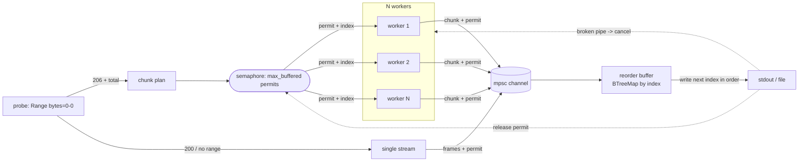

# pcurl

Parallel HTTP downloader that streams strictly in order to stdout, ready to pipe
straight into a decompressor.

```sh
pcurl https://example.com/huge.tar.zst | zstd -d | tar x
```

`pcurl` splits a remote file into byte ranges, fetches them over several
connections at once to beat single-connection rate limits, reassembles them in
order inside a bounded in-memory buffer, and writes the original byte stream to
stdout. The byte order on stdout is identical to the source file, so the output
is safe to pipe into `zstd`, `gzip`, `tar`, or any streaming consumer.

## Features

- Multi-connection range download: N workers fetch `Range` chunks in parallel.
- Strict in-order output: out-of-order chunks are reordered before they reach stdout.
- Bounded memory: peak usage is about `max_buffered * chunk_size`, regardless of download speed.
- Pipe friendly: data on stdout, progress on stderr, clean stop on a broken pipe.
- Verbatim bytes: no transparent content-decoding, so the output equals the file as served.
- Per-chunk retry with capped exponential backoff and jitter.
- Automatic fallback to a single straight-through stream when the server does not support ranges.
- Optional structured file logging with rotation, alongside leveled stderr logs.

## Install

```sh
cargo install --path .
# or build a release binary
cargo build --release   # ./target/release/pcurl
```

## Usage

```sh
pcurl [OPTIONS] <URL>
```

Common options:

| Option | Default | Meaning |
| --- | --- | --- |
| `-c, --connections <N>` | `8` | Parallel connections (workers). |
| `-s, --chunk-size <SIZE>` | `8M` | Range chunk size (`4M`, `512K`, `1048576`). |
| `--max-buffered <N>` | `= connections` | Max chunks held in memory; peak memory `~= N * chunk_size`. |
| `-r, --retries <N>` | `5` | Per-chunk retry attempts after the first failure. |
| `-t, --timeout <SECS>` | `60` | Connect + idle (read) timeout; resets per read, so it bounds stalls without killing a slow transfer (`0` disables). |
| `-o, --output <FILE>` | stdout | Write to a file instead of stdout. |
| `--single` | off | Force a single straight-through stream. |
| `-H, --header <H>` | none | Extra request header (`"Name: value"`), repeatable. |
| `-q, --quiet` | off | Suppress the stderr progress line. |
| `-v, --verbose` | off | More logs on stderr (`-v`, `-vv`); `RUST_LOG` overrides. |
| `--log-dir <DIR>` | none | Also write rotating logs to a directory. |

Examples:

```sh
# Download and extract a compressed archive in one pass
pcurl https://example.com/dataset.tar.zst | zstd -d | tar x

# 16 connections, 4 MiB chunks, capped memory at 8 chunks (~32 MiB)
pcurl -c 16 -s 4M --max-buffered 8 https://example.com/big.bin > big.bin

# Send an auth header; write to a file
pcurl -H "Authorization: Bearer $TOKEN" -o out.bin https://host/object
```

## How it works



The memory bound and ordering guarantee come from one invariant: every chunk that
is in flight or buffered holds exactly one semaphore permit, and a permit is
released only after its chunk has been written to the output. A worker must take
a permit before claiming the next chunk index, so the number of chunks alive at
once never exceeds `max_buffered`. Because indices are handed out in increasing
order, the chunk the writer needs next is always already in flight, so reassembly
never stalls.

When the consumer closes the output early (for example `| head`), the next write
fails with a broken pipe; the writer cancels all workers and the process exits
cleanly.

## Logging

Logs go to stderr (never stdout). Levels: `TRACE`, `DEBUG`, `INFO`, `WARN`,
`ERROR`, filterable per module via `RUST_LOG` (which overrides `-v`). With
`--log-dir`, logs are also written to a daily-rotating file keeping the most
recent `--log-keep` files.

## Development

```sh
cargo test            # unit + integration + end-to-end (tar.zst pipeline)
cargo clippy --all-targets -- -D warnings
cargo fmt --check
```

## License

MIT. See [LICENSE](LICENSE).
