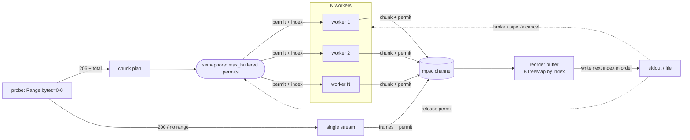

# pcurl

[English](README.md) · **简体中文** · [日本語](README.ja.md) · [한국어](README.ko.md) · [Español](README.es.md)

并行 HTTP 下载器,严格按顺序流式输出到 stdout,可直接管道喂给解压器。

```sh
pcurl https://example.com/huge.tar.zst | zstd -d | tar x
```

`pcurl` 把远端文件切成字节范围,用多条连接同时抓取以绕过单连接限速,在一个有界的内存
缓冲里按顺序重组,再把原始字节流写到 stdout。stdout 上的字节顺序与源文件完全一致,所以
输出可以安全地管道给 `zstd`、`gzip`、`tar` 或任何流式消费端。

## 适用场景

你有一个很大的压缩包 —— 数据集、模型权重、备份 —— 需要在一台**装不下「压缩包 *加上*
解压结果」**的机器上解压。常规做法是把下载直接流给解压器,让压缩文件根本不落盘:

```sh
curl https://host/huge.tar.zst | zstd -d | tar x
```

这样磁盘只需要放解压出来的文件 —— 但 `curl` 走单连接。面对单连接限速(或在高带宽、高
延迟的链路上,一条 TCP 流根本喂不满),一个数 TB 的压缩包可能要下好几天。

并行下载器(`aria2c`、`axel` 等)能用多条连接,但它们**把文件写到磁盘** —— 又把整个
压缩包塞回了你想避开的磁盘。

`pcurl` 填补的正是这个空缺:它用多条连接并行抓取,**同时**严格按顺序流式输出到 stdout,
因此能直接接进同一条管道:

```sh
pcurl https://host/huge.tar.zst | zstd -d | tar x
```

|                         | 流式进管道(压缩包不落盘) | 多连接并行 |
| ----------------------- | :---: | :---: |
| `curl \| zstd \| tar`   | yes   | no    |
| `aria2c`、`axel`        | no    | yes   |
| `pcurl \| zstd \| tar`  | yes   | yes   |

你得到的是并行吞吐 + curl 的流式模型:压缩包从不被存下,只有解压后的内容落盘。内存保持
有界(一个与压缩包大小无关的小固定缓冲),而且如果解压器或磁盘跟不上,管道会自动对下载
施加反压 —— 所以空间或内存吃紧的机器始终待在自己的限额内。

## 特性

- 多连接范围下载:N 个 worker 并行抓取 `Range` 分块,默认走 HTTP/1.1,因此每条都是独立 TCP 连接(用 `--http2` 改为多路复用到一条上)。
- 严格有序输出:乱序到达的分块在到达 stdout 之前被重排。
- 内存有界:峰值约为 `max_buffered * chunk_size`,与下载速度无关。
- 对管道友好:数据走 stdout,进度走 stderr,管道断开时干净停止。
- 字节原样:不做透明内容解码,所以输出等于服务器提供的文件。
- 按分块重试,带封顶指数退避与抖动。
- 服务器不支持范围请求时,自动回退为单条直通流。
- 可选的结构化文件日志(支持轮转),与分级 stderr 日志并存。

## 安装

```sh
cargo install --path .
# 或构建发布二进制
cargo build --release   # ./target/release/pcurl
```

## 用法

```sh
pcurl [OPTIONS] <URL>
```

常用选项:

| 选项 | 默认值 | 含义 |
| --- | --- | --- |
| `-c, --connections <N>` | `8` | 并行连接数(worker)。 |
| `-s, --chunk-size <SIZE>` | `8M` | 范围分块大小(`4M`、`512K`、`1048576`)。 |
| `--max-buffered <N>` | `= 2 × connections` | 内存中同时持有的最大分块数;峰值内存 `~= N * chunk_size`。这点读前余量让单个慢分块不会卡住有序写出。 |
| `-r, --retries <N>` | `20` | 每分块的重试次数;仅当 `--retry-max-secs 0` 时生效。 |
| `--retry-max-secs <SECS>` | `300` | 每分块的墙钟重试预算:某分块持续重试瞬时失败直到这段时间耗尽,这样快速拒绝型故障不会像固定次数那样迅速中止整个下载(`0` = 改用 `--retries`)。 |
| `-t, --timeout <SECS>` | `60` | 连接 + 空闲(读)超时;每次读取后重置,因此只约束停滞而不会杀死健康的慢传输(`0` 关闭)。 |
| `--min-speed <SIZE>` | `8K` | 每分块的最低持续速度;某分块在 `--min-speed-window`(默认 `15` 秒)内平均低于此值会被丢弃并重试,以免一条涓流连接卡死整条流(`0` 关闭)。要在快链路上重发「仅仅是慢、并未卡死」的边缘,调高此值(例如 `1M`)并把 `--min-speed-window` 设到健康分块传输时间以下。 |
| `-o, --output <FILE>` | stdout | 写入文件而非 stdout。 |
| `--single` | off | 强制单条直通流。 |
| `--http2` | off | 服务器支持时使用 HTTP/2。默认 pcurl 强制 HTTP/1.1,使每条连接是独立 TCP 流;走 HTTP/2 时各 worker 会复用到一条连接上,无法绕过单连接限速。 |
| `-H, --header <H>` | 无 | 附加请求头(`"Name: value"`),可重复。 |
| `-q, --quiet` | off | 抑制 stderr 上的进度行。 |
| `-v, --verbose` | off | 更多 stderr 日志(`-v`、`-vv`);`RUST_LOG` 优先。 |
| `--log-dir <DIR>` | 无 | 同时把轮转日志写入某目录。 |

示例:

```sh
# 一次完成下载并解压一个压缩包
pcurl https://example.com/dataset.tar.zst | zstd -d | tar x

# 16 连接,4 MiB 分块,内存上限 8 块(~32 MiB)
pcurl -c 16 -s 4M --max-buffered 8 https://example.com/big.bin > big.bin

# 发送认证头;写入文件
pcurl -H "Authorization: Bearer $TOKEN" -o out.bin https://host/object
```

## 工作原理



内存上界与顺序保证来自同一条不变量:每个在途或缓冲中的分块恰好持有一个信号量许可,而许可
只有在其分块被写到输出之后才释放。worker 必须先拿到许可才能领取下一个分块索引,所以同时
存活的分块数永不超过 `max_buffered`。又因为索引是按递增顺序发放的,写出端下一个需要的分块
总是已经在途,所以重组永不停滞。

当消费端提前关闭输出(例如 `| head`)时,下一次写入会因管道断开而失败;写出端取消所有
worker,进程干净退出。

## 管道中的退出码

干净的下载退出 `0`;失败的下载(某分块不可恢复地出错,或并非所有字节都写出)退出非零。
消费端提前关闭管道对 pcurl 而言是成功。终止信号(SIGINT/SIGTERM)会取消本次运行并退出
`130`;由于不支持续传,被中断的下载必须重新开始。在 shell 管道里,整体退出码是最后一级的,
所以请用 `set -o pipefail` 并检查 pcurl 自己的退出码,才能捕获下载失败:

```sh
set -o pipefail
pcurl https://example.com/huge.tar.zst | zstd -d | tar x
echo "pcurl=${PIPESTATUS[0]} zstd=${PIPESTATUS[1]} tar=${PIPESTATUS[2]}"
```

下游工具自身的失败(例如 `tar x` 把磁盘写满)通过它自己的退出码体现,而不是 pcurl 的。

## 日志

日志走 stderr(绝不走 stdout)。级别:`TRACE`、`DEBUG`、`INFO`、`WARN`、`ERROR`,可通过
`RUST_LOG` 按模块过滤(它覆盖 `-v`)。设置 `--log-dir` 后,日志还会写入按天轮转的文件,保留
最近 `--log-keep` 份。

## 开发

```sh
cargo test                       # 单元 + 集成 + 端到端(端到端的管道测试需要 zstd)
cargo test --test e2e <name>     # 单个端到端测试
cargo clippy --all-targets -- -D warnings
cargo fmt --check
```

集成测试驱动编译后的二进制去打一个本地 `tiny_http` 服务器(`tests/common`),且串行运行,
所以整套测试约 15-20 秒。

## 许可证

MIT。见 [LICENSE](LICENSE)。
